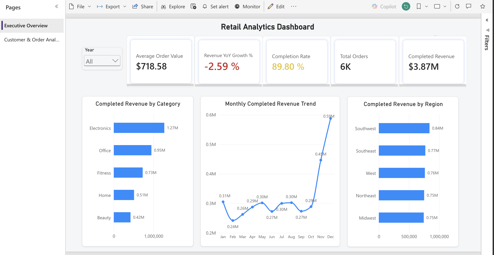
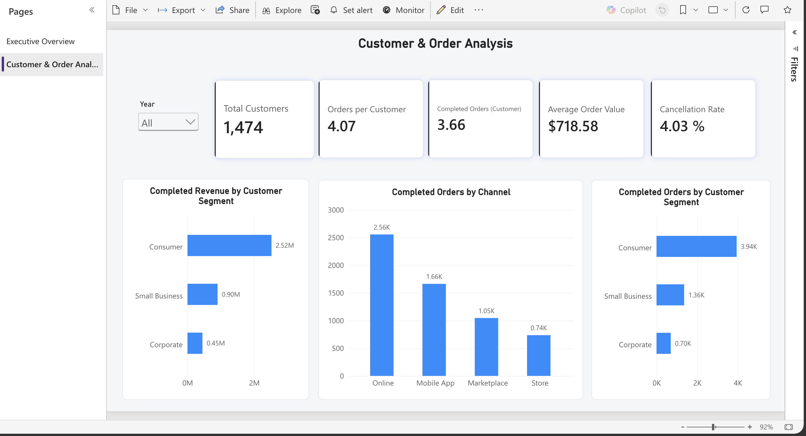

# retail-analytics-power-bi
Interactive Power BI retail analytics dashboard analyzing revenue, orders, customer segments, channels, and regional performance.
# Retail Analytics Power BI Dashboard

## Project Overview

This project is an interactive Power BI dashboard built to analyze retail performance across revenue, orders, customer segments, channels, product categories, and regions.

The dashboard is designed as a two-page business intelligence solution:

- **Executive Overview** — high-level KPIs and performance trends
- **Customer & Order Analysis** — customer behavior, order frequency, channel usage, and segment performance

## Business Questions

This dashboard was built to answer questions such as:

- How much completed revenue is being generated?
- How are order volume and completion rates trending?
- How is revenue changing year over year?
- Which product categories generate the most completed revenue?
- Which regions contribute the most revenue?
- Which customer segments generate the most revenue and completed orders?
- Which sales channels drive the highest order volume?
- How frequently are customers placing and completing orders?

## Dashboard Pages

### 1. Executive Overview

Key metrics include:

- Average Order Value
- Revenue YoY Growth %
- Completion Rate
- Total Orders
- Completed Revenue

Analysis includes:

- Completed Revenue by Category
- Monthly Completed Revenue Trend
- Completed Revenue by Region
- Year-based filtering



### 2. Customer & Order Analysis

Key metrics include:

- Total Customers
- Orders per Customer
- Completed Orders per Customer
- Average Order Value
- Cancellation Rate

Analysis includes:

- Completed Revenue by Customer Segment
- Completed Orders by Channel
- Completed Orders by Customer Segment
- Year-based filtering



## Data Model

The Power BI model uses a relational structure connecting:

- customers
- orders
- order_items
- products
- regions
- Date

The Date table supports time-based filtering and year-over-year analysis.

## DAX Measures

Custom DAX measures were created for:

- Total Revenue
- Completed Revenue
- Average Order Value
- Revenue YoY Growth %
- Total Orders
- Completed Orders
- Completion Rate
- Cancellation Rate
- Return Rate
- Units per Order
- Total Customers
- Orders per Customer
- Completed Orders per Customer
- Average Discount

Detailed DAX formulas are documented in the [`dax`](dax/) folder.

## Key Insights

- Consumer customers generate the largest share of completed revenue and completed orders.
- Online is the highest-volume order channel.
- Completed revenue varies significantly across product categories and regions.
- The dashboard supports year-level filtering to compare 2024 and 2025 performance.
- Revenue YoY analysis dynamically compares the selected year with the previous year.

## Tools & Skills Demonstrated

- Power BI
- DAX
- Data Modeling
- KPI Development
- Data Visualization
- Business Intelligence
- Customer Segmentation Analysis
- Revenue Analysis
- Order Analysis
- Time Intelligence
- Interactive Filtering
- Dashboard Design

## Repository Structure

```text
retail-analytics-power-bi/
│
├── README.md
├── dashboard/
├── screenshots/
│   ├── executive-overview.png
│   └── customer-order-analysis.png
├── dax/
│   └── README.md
└── data/
    └── README.md

└── data/
    └── README.md
```

## Author

Mahanthi Gade
